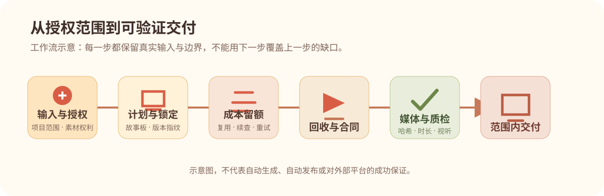

# 质量与验收

## 37 项不是“建议清单”

插件保留 37 项原始一票否决：从未授权发布、音画母钟漂移、字幕可读性、样片与粗剪前置，到来源、动态时长、背景音乐、视觉层级和学生资料话术。任一命中都应停止推进并报告具体缺口，而不是用“文件已经导出”或“机器检查通过”替代解决。

公开目录在：

```text
plugins/muzhi-editorial-studio/assets/critical-rules.json
```

它保存每条否决原文、对应源行号、检查路径与来源哈希。运行下列命令会确认 37 条文本、行号、引用文件和重新计算后的源哈希仍一致：

```bash
python -X utf8 <PLUGIN_ROOT>/scripts/verify_rule_coverage.py
```

这项检查只证明规则目录没有被删改，**不**证明一段真实视频已经好看、好听或适合发布。

## 阶段检查



| 阶段 | 检查重点 | 不应被替代为 |
| --- | --- | --- |
| 设计锁 | 已批准的设计资料、真实哈希与引用 | 一个口头“风格差不多” |
| 故事板／批量前 | 完整口播覆盖、语义路由、样片和合同 | 固定镜头数量或静态拼图 |
| 动态回收 | 实际时长、速度、续接、音轨与文件身份 | 文件名或供应商页面文字 |
| 母版前 | 项目合同、QA 证据和完整观看记录 | 一个 `passed: true` 字符串 |
| 发布包 | 认可的母版、适配封面、正确文本与范围 | “成片通过”等同于“已发布” |

计划和检查入口：

```bash
python <PLUGIN_ROOT>/scripts/production_runner.py plan --stage design
python <PLUGIN_ROOT>/scripts/production_runner.py check --project <PROJECT_ROOT> --stage design
python <PLUGIN_ROOT>/scripts/production_runner.py media-audit \
  --project <PROJECT_ROOT> --manifest <PROJECT_ROOT>/artifacts/media-audit.json --decode
```

`media-audit` 需要真实文件和能使用的 ffprobe；完整解码还需要 ffmpeg。缺依赖时，脚本应如实报告，不能假装媒体已经被验证。

## 人工审查仍不可省略

即使所有脚本返回通过，也应对真实内容检查：

- 口播是否清晰，音乐是否可感知却不压人声；
- 字幕是否在手机尺寸可读，且避让主视觉与解释文字；
- 动作、解释、结论是否与口播关键词同步；
- 是否出现像 PPT、廉价 AI、画风混乱、动画僵硬等否决观感；
- 是否把版权、数据来源、公开授权和平台状态说成已经完成。

用户可以调整本轮审核安排，但代理不能虚构用户看过尚未生成的素材，也不能把“允许直接做”记录成“用户视觉批准”。

## 自动化验证基线

公开包包含四组标准库测试，覆盖项目状态、渠道合同、阶段运行器和成本台账；另保留三组上游负向校验，覆盖故事板、动态素材时长和生产强制合同。本次公开基线实际运行 149 项测试。运行方式见 [README](../README.md#验证基线)。它们是回归保护，不是对任意供应商、任意内容或任意平台状态的保证。
